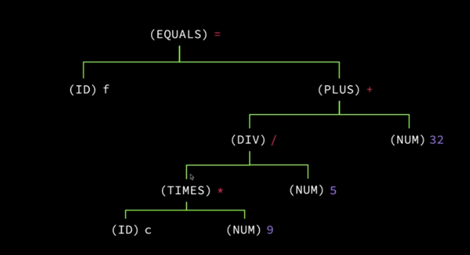
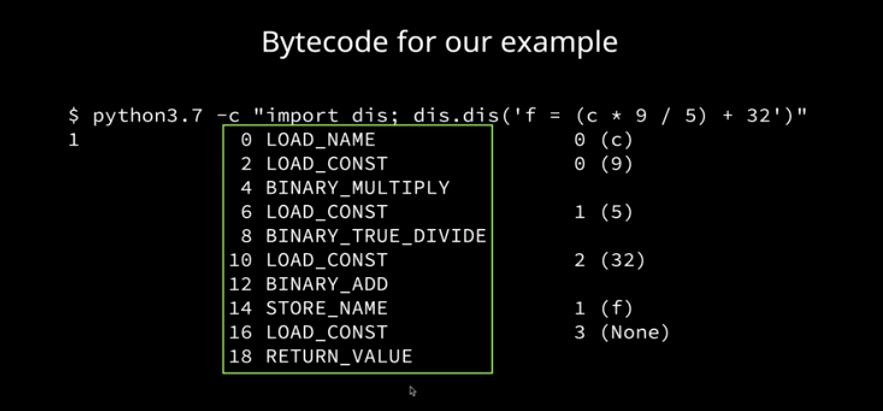

## Compilers
- Compiles high level language code (Python) down to machine code
- Compiling consists of the following steps:
    - Lexical Analysis (Lexing):  Classifies each word
    - Syntax Analysis (Parsing):  Order or operation/applies rules of the language
    - Semantic Analysis:  Verifies syntax for specific programming language
    - Optimization:  Rewrites code to be more optimizec
    - Code Generation:  Generates the code

## Interpreter
- Souce code gets passed into the intrepter and then gets executed
- Interpreting consists of the following:
    - Parsing Souce code
    - Executing Source code
    - Compile to intermediate form and then execute

## Lexing
- Lexical analysis breaks up source code into identified tokens
- Example:
    `f = (c * 9 / 5) + 32` becomes:
    (ID) `f`, (EQUALS)`=`, (RPAREN) `(`, (ID)`c`, (TIMES)`*`,(NUM)`9`,(DIV)`/` , (NUM)`5`, (LPRAEN) `)`, (PLUS) `+`,(NUM)`32` 

## Syntax Analysis
- Process of constructiong a parse tree using the tokens provided by the lexer.  Parsing provides context about how the code should run (order of operation)
- Example:
    

## Semantic Analysis
- Process of applying language rules to the parse tree.  This includes raising errors when rules are broken
- Examples of errors caught include:
    - Type Mismatch (static complied language)
    - Use a undeclared variable
    - Parameter mismatch

## Keywords
- keywords are reserved words that can't be used as identifiers in your code.

## Bytecode Instructions
- Bytecode instructions are the various commands that the Python VM knows how to run.  Python is an intrepeted language, but source code is still compiled to bytecode before it's ran
    

## REPL
- Read:  Read the user input
- Evaluate:  Evaluate your code
- Print:  Print any results
- Loop:  Loop back to step 1 