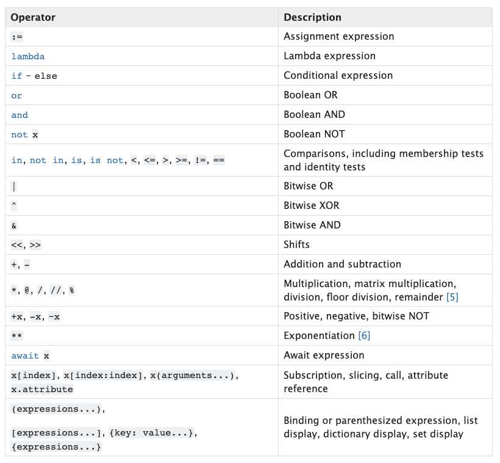

# Order of operations

#### Just like in math, () are executed first

#### Lists, Dictionaries and Sets are created before any operations are executed

#### Exponents
#### Positive operators
#### Negative Operators
#### Bitwise Operators

#### Multiplication *
#### Division /
#### Floor Division //
#### Modular Operator %
#### Addition
#### Subtraction
#### Bitwise Shifts << & >>
#### Bitwise AND &
#### Bitwise XOR ^
#### Bitwise OR |
#### Comparison operators (in, not in, is, is not, <, >, <=, >=, ==, !=)
#### Boolean NOT not
#### Boolean AND and
#### Boolean OR or
#### Conditions if

#### >>> 14 & 3 * 2 + 4
#### 10
#### >>> 14 & 3 * (2 + 4)
#### 2
#### >>> (14 & 3) * 2 + 4
#### 8
#### >>> 14 & (3 * 2) + 4
#### 10